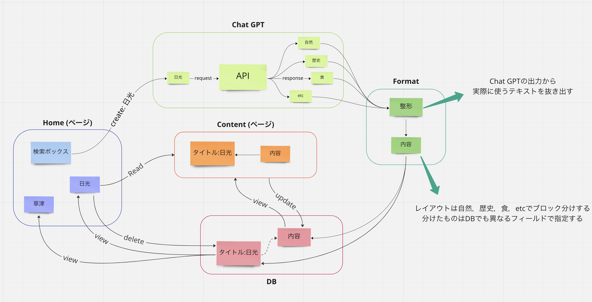
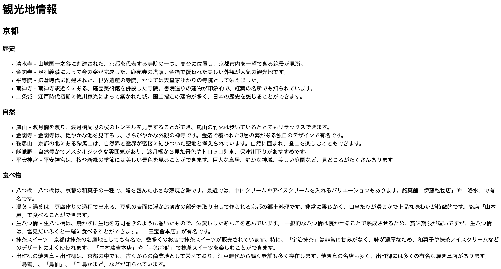
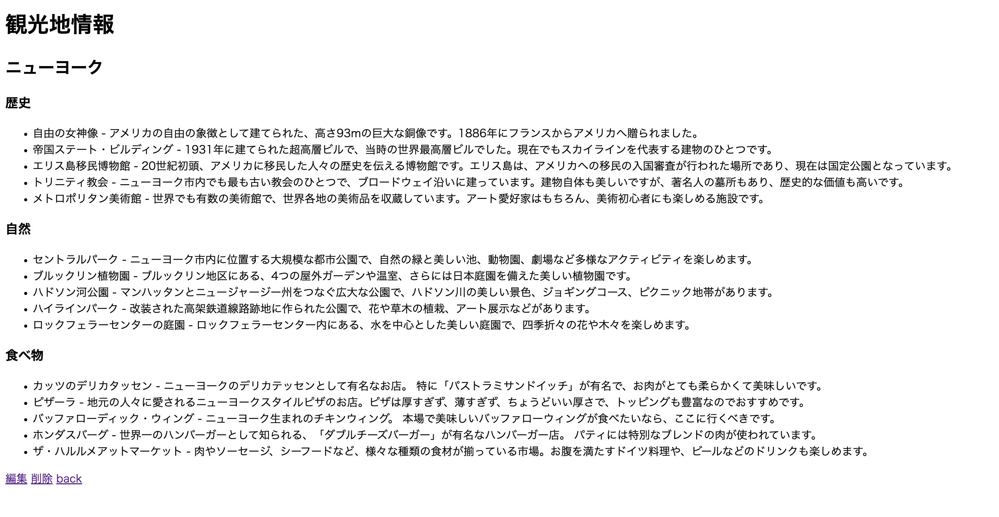

# (タイトル)
**概要**
- 観光地を指定すると，周辺の観光スポットやご当地グルメの情報を表示する
- 表示する情報は，自然，歴史，食，文化，レジャーなどカテゴリ分けする
- 情報の検索にはChat GPTを使用する
- Chat GPTを使用することで，世界中のどんな観光地でも検索できる



**完成図 (途中)**




## 初回にやること
- sailをインストール
- `sail`コマンドを使えるようにする

### sailのインストール
```
    docker run --rm \
        -u "$(id -u):$(id -g)" \
        -v $(pwd):/var/www/html \
        -w /var/www/html \
        laravelsail/php81-composer:latest \
        composer install --ignore-platform-reqs
```

### sailコマンドのパスを通す
- `sail`コマンドは`<workdir>/vendor/bin/sail`にある
- `.bashrc`ファイルなどに以下を追記する
```
    alias sail='[ -f sail ] && bash sail || bash vendor/bin/sail'
```

### .envファイルの用意
<!-- 
    .envファイルは環境設定ファイルで，git管理してはいけない
        (.gitignoreに記載済み)
    代わりに.env.exampleをgit管理して共有する
-->
- `.env.example`を複製し，`.env`にリネームする

## コンテナの操作
- コンテナの立ち上げ
```
    sail up -d
```

- コンテナの破棄
```
    sail down
```

## DB
- マイグレーションの実行
```
    sail artisan migrate
```

- シーディングの実行
    - データベースに開発用データを入れる
```
    sail artisan db:seed
```

- テーブルのクリア
```
    sail mysql

    mysql> truncate table <table_name>;
```

## URL
(リファレンスをまとめておく場所)

- Githubのコミットメッセージに使う表現
https://qiita.com/shikichee/items/a5f922a3ef3aa58a1839

- リレーショナルなEloquent Model
https://migisanblog.com/laravel-eloquent-relation/

- reactの導入
https://saunabouya.com/2022/07/25/laravel9-sail-react-typescript-vite/